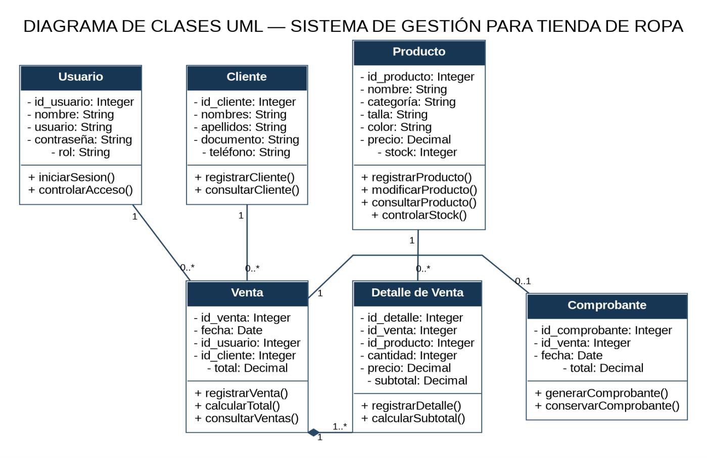

# Sistema de Gestión para una Tienda de Ropa

Proyecto de la asignatura **Programación Orientada a Objetos (POO)** — IESTP "PAIJÁN", 2026.
Estudiante: Sonia Jhaquelin Ocas Azañero.

## Objetivo

Modelar e implementar un sistema de gestión para una tienda de ropa: registro de
productos, clientes y ventas, control de stock, cálculo de totales y generación de
comprobantes, aplicando los conceptos de UML y POO (clases, atributos, métodos,
visibilidad, relaciones y composición).

## Diagrama de clases UML



## Estructura del repositorio

```
├── docs/        Informes del proyecto (PDF original Semana 07)
├── diagramas/   Diagramas UML del sistema (imágenes)
├── src/         Código fuente del sistema (sistema_tienda.py)
├── tests/       Pruebas unittest (test_sistema_tienda.py)
├── revisiones/  Avances y revisiones por semana (semana07/)
├── README.md
└── .gitignore
```

## Cómo ejecutar

Desde PowerShell, en la raíz del repositorio:

```powershell
# Ejecutar el ejemplo del sistema
py src/sistema_tienda.py

# Ejecutar las pruebas
py -m unittest tests/test_sistema_tienda.py -v
```

Salida esperada de las pruebas: **5 tests OK**, con total `Decimal("130.00")` y
stock actualizado (P001: 8, P002: 4).

## Decisión de diseño (Semana 07)

Se seleccionó **composición** para la relación `Venta — DetalleVenta` ("una Venta
tiene uno o más Detalle de Venta"). Se descartaron herencia (no hay relación
"es un") e interfaz (no hay contrato común), evitando sobreingeniería.

## Informe

El informe completo de la Semana 07 se encuentra en
[`docs/Informe_Sonia_Tienda_Ropa_programacion_Semana_07.pdf`](docs/Informe_Sonia_Tienda_Ropa_programacion_Semana_07.pdf).
